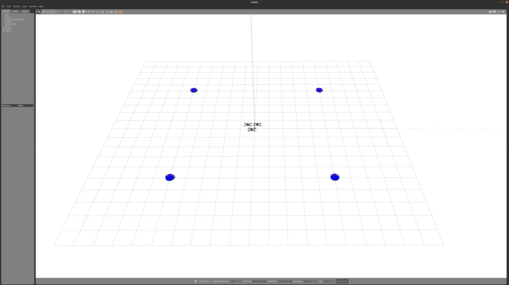

# cdpr_uav_ddrive

最终版程序请转至分支 final_version_3。此分支不再维护。

## Environments
- 整个环境是在`apm`飞控下运行成功的。所以在运行本环境之前，需要安装好mavros和apm，[Intelligent Quads Tutorials](https://github.com/Intelligent-Quads/iq_tutorials)
- 安装好后，将本功能包从仓库上git clone下来：
```bash
git clone https://github.com/CHH3213/cdpr_uav_ddrive_endition2.git
```
- 将功能包名字修改为`cdpr_uav_ddrive`：

```bash
cp cdpr_uav_ddrive_endition2 cdpr_uav_ddrive
```

- 将整个`cdpr_uav_ddrive`功能包放到ros工作空间中，并编译和source

  ```bash
  cd ~/ros_ws/
  catkin_make
  source devel/setup.sh
  ```

- 进入bash文件夹，给bash脚本添加权限

  ```bash
  chmod a+x start_multi_drone.sh
  chmod a+x ardupilot.sh
  ```


- 运行bash脚本，正常可以打开环境：
  （作者的环境需要在`tftorch`虚拟环境下运行。）
  ```
  ./start_multi_drone.sh
  ```

- 打开环境，正常打开后应该会有如下界面：

  

- 如果在运行bash脚本后仿真环境无法正常工作，则依次打开不同终端手动运行：
  ```bash
  roslaunch cdpr_uav_ddrive multi_drone.launch
  ./start_multi_drone.sh  # 注释掉该文件里的两行lanuch命令。
  roslaunch cdpr_uav_ddrive multi-apm.launch
  ```


## launch文件夹说明
- `apm.launch`:单架无人机下的mavros开启
- `multi-apm.launch`:多架无人机下的mavros开启（默认开启三架）
- `multi_drone.launch`：仿真环境launch文件

## bash文件夹说明
- `reset_params.sh`和`rc_multi_drone.sh`是修改`rc/override`的，在这里未用到。
- `multi-ardupilot.sh`：开启软件在环仿真（SITL）
- `start_multi_drone.sh`：是整个项目运行的脚本
## 运行

在`scripts`文件夹下，主要的main函数有`experi_2dBA`,`experi_2dSA`,`experi_3drone`分别表示2架无人机大间距，两架无人机无间距，两架无人机小间距，3架无人机。需要分别打开对应的环境才可以运行(在`multi_drone.launch`文件中切换)。
- 首先运行`cmd_force.py`
- 而后运行相应的main函数：
  - `experi_2dBA.py`:2架无人机大间距下的实验主程序
  - `experi_2dSA.py`:2架无人机小间距下的实验主程序
  - `experi_3drone.py`:3架无人机下的实验主程序

